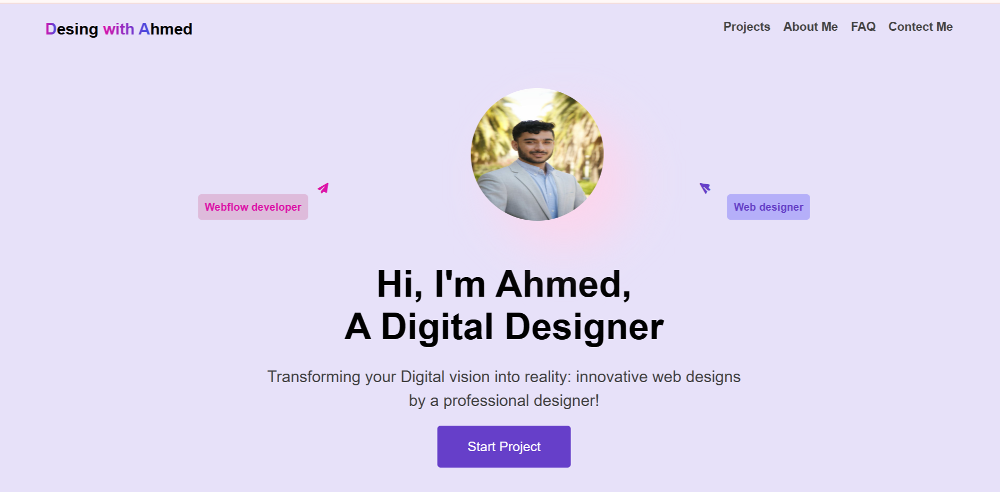

# Personal Portfolio Web Page 🌐

This is a simple, clean, and responsive personal portfolio webpage created using only **HTML** and **CSS**.  
It can be used as a starter template to showcase your personal profile, projects, and contact details.

---

## 📁 Project Structure

POR/
├── images/
│ └── man2.jpeg # Profile or visual image
├── index.html # Main HTML file
├── style.css # CSS styling
└── README.md # This file (project description)


## 🚀 Features

- Responsive layout (basic)
- Personal introduction section
- Image display from `/images/`
- External CSS for clean styling
- Beginner-friendly codebase

---

## 🛠️ Technologies Used

- HTML5
- CSS3
- VS Code (recommended editor)
- Git & GitHub (for version control)

---

## 📸 Preview

Open `index.html` in your browser to see the live webpage.

### 🖼️ Screenshot



---

## 🔧 How to Customize

- Replace `man2.jpeg` with your own profile or project image.
- Update text in `index.html` (about, name, links, etc).
- Style your layout using `style.css`.
- Optionally add more sections like "Projects", "Contact", "Skills", etc.

---

## 💻 Installation & Usage

```bash
git clone https://github.com/maryamiina2284/portifolioDesign.git
cd portifolioDesign
# Open index.html in your browser


👩‍💻 Author
Maryam Iina
FullStack Developer
GitHub: @maryamiina2284
